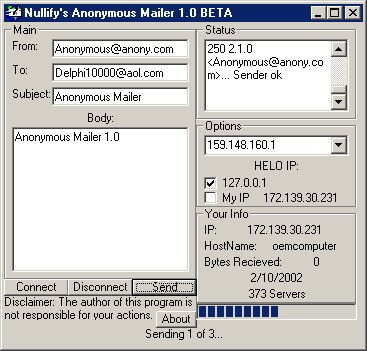



## Anonymous Mailer 1\.3\(UPDATE\)

### Description

Bug fix and some stuff added. This is a basic Anonymous Mailer. Sends e-mails using a fake e-mail address. Feilds include From, To, Subject and Body. Also sends feilds:"Content-Type","X-Mailer" and "Importance". Switch the HELO address to 127.0.0.1 or your own IP. And this comes with 373 SMTP Servers, I think they work but I dont have time to test them all. So if your dont have anyother reason to download this you can take the SMTP Servers for your own programs.
 
### More Info
 
If your an AOL user then you will have and "X-Apparently-From: Yourscreenname@aol.com" If you click the "Details" thing on the e-mail.

             |
---                |---
**Submitted On**   |2002-02-22 15:35:38
**By**             |[Nullific](https://github.com/Planet-Source-Code/PSCIndex/blob/master/ByAuthor/nullific.md)
**Level**          |Beginner
**User Rating**    |4.3 (26 globes from 6 users)
**Compatibility**  |VB 6\.0
**Category**       |[Internet/ HTML](https://github.com/Planet-Source-Code/PSCIndex/blob/master/ByCategory/internet-html__1-34.md)
**World**          |[Visual Basic](https://github.com/Planet-Source-Code/PSCIndex/blob/master/ByWorld/visual-basic.md)
**Archive File**   |[Anonymous\_5687122220\.zip](https://github.com/Planet-Source-Code/nullific-anonymous-mailer-1-3-update__1-31661/archive/master.zip)

